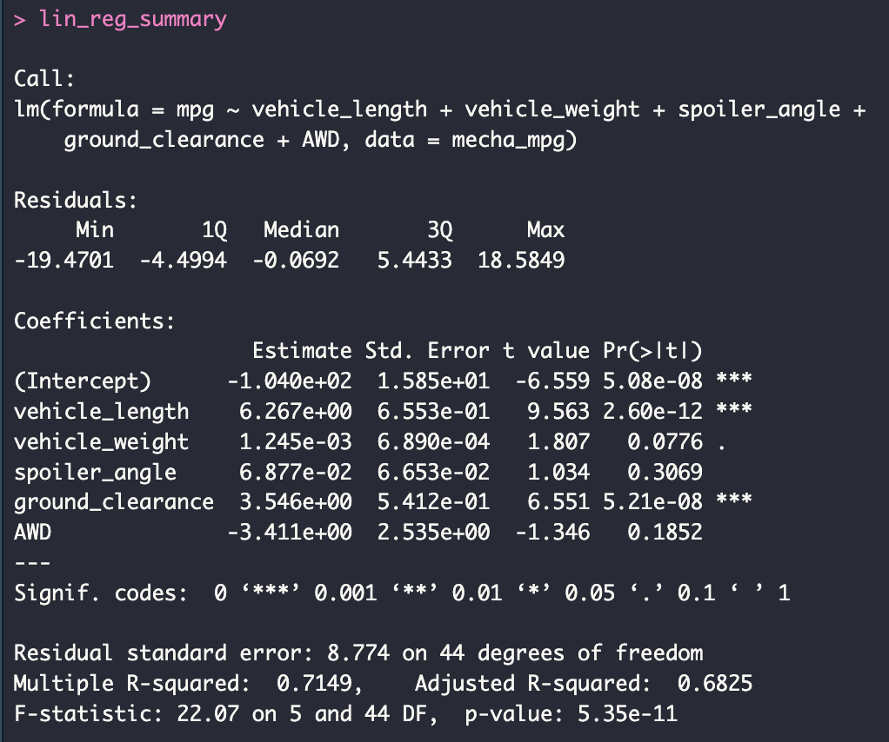
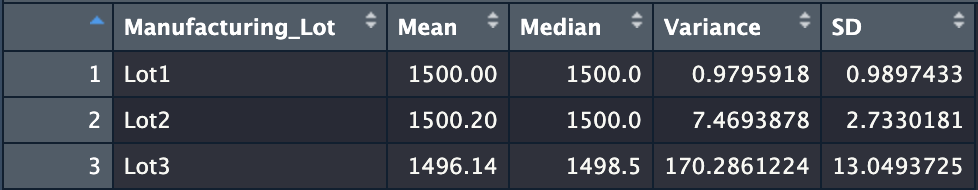
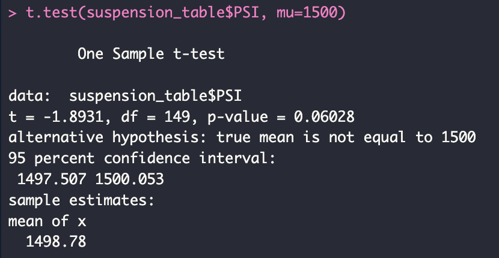
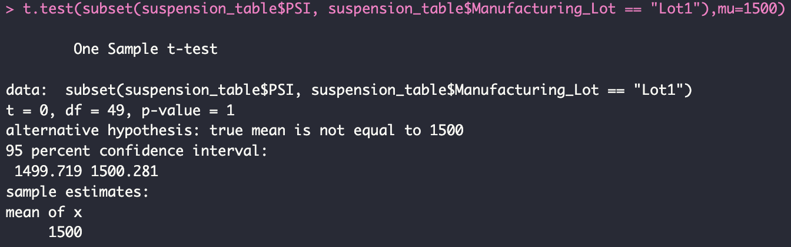
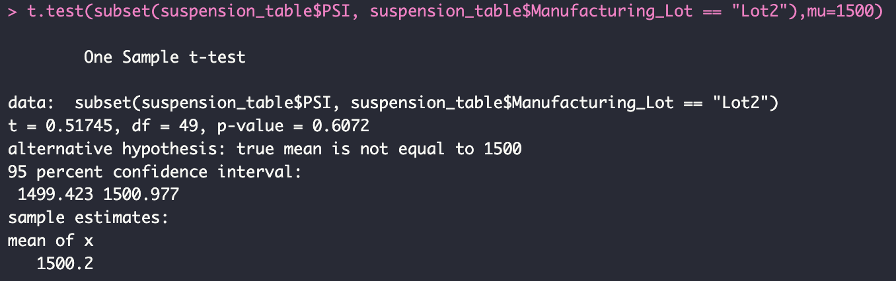
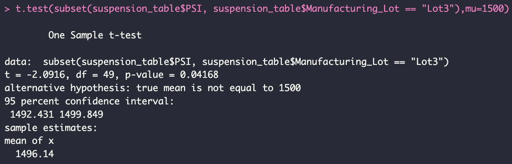

# MechaCar Statistical Analysis

## Overview of Project

### Purpose

The purpose of this project is to use `R` to do some statistical analysis on sample data from MechaCars. The focus will be on: 

- MPG analysis. This will be to determine if there are any other variables which provide a non-random amount of variance to MPG.
- Suspension coil manufacturing requirements analysis. This will be to determine if the manufacturing process

## Results

### Linear Regression to Predict MPG

The variables which provide a non-random amount of variance are:

- `vehicle_length`. With a p-value of **2.60e-12**, this independent variable has significant impact on the `mpg` variable.
- `ground_clearance`. With a p-value of **5.21e-08**, this independent variable has significant impact on the `mpg` variable.
- `vehicle_weight`. With a p-value of **0.0776**, this independent variable has a slight impact on the `mpg` variable.

The slope of the linear model is not likely to be considered zero. This can be seen by the low p-values of `vehicle_length`, `ground_clearance`, and `vehicle_weight` independent variables. Based on these significant coefficients and high r-squared value, it is likely that the slope is non-zero.

The multiple linear regression model seems to be a good predictor of the `mpg` variable of MechaCar prototypes. The model has a high R-squared value of 0.7149, indicating that 71.49% of the variation in `mpg` is explained by the independent variables in the model.  

### Summary Statistics on Suspension Coils

*The design specifications for the MechaCar suspension coils dictate that the variance of the suspension coils must not exceed 100 pounds per square inch.*
#### Overall Manufacturing Coils PSI Summary

When considering the manufacturing data as a whole, the variance of **62.29356** does not exceed the 100 pounds per square inch threshold and therefore meets the manufacturing requirements.

#### Individual Lot Manufacturing Coils PSI Summary

When considering the manufacturing data individually per lot:

- Lot1: the variance of **0.9795918** does not exceed the 100 pounds per square inch threshold and therefore **MEETS** the manufacturing requirements.

- Lot2: the variance of **7.4693878** does not exceed the 100 pounds per square inch threshold and therefore **MEETS** the manufacturing requirements.

- Lot3: the variance of **170.2861224** exceeds the 100 pounds per square inch threshold and therefore **FAILS** the manufacturing requirements.

### T-Tests on Suspension Coils

*The following One-Sample T-Tests are conducted to determine if the PSI is statistically different from the population mean of 1,500 pounds per square inch. I will also reference the p-value typical threshold of statistical significance as being 0.05.*

#### Overall Manufacturing One-Sample T-Test

The p-value of **0.06028** is higher than the typical threshold of 0.05 for statistical significance. Therefore, we can conclude that the sample mean is not statistically different from the population mean at the typical level of significance.

#### Lot 1 Manufacturing One-Sample T-Test

The p-value of **1** is the highest possible p-value. Therefore, we can conclude with high certainty that the sample mean is not statistically different from the population mean.

#### Lot 2 Manufacturing One-Sample T-Test

The p-value of **0.6072** is much higher than the typical threshold of 0.05 for statistical significance. Therefore, we can conclude that the sample mean is not statistically different from the population mean at the many different levels of significance.

#### Lot 3 Manufacturing One-Sample T-Test

The p-value of **0.04168** is lower than the typical threshold of 0.05 for statistical significance. Therefore, we can conclude that sample mean is statistically different from the population mean at the typical level of significance.

## Additional Study

### Study Design: MechaCar vs Competition

An additional statistical study that would be of interest to **money-saving** consumers would be to test the fuel efficiency and cost of MechaCar vehicles against those of other manufacturers.

#### Metrics

We will be comparing the average city and highway fuel efficiency of MechaCar vehicles to the fuel efficiency of vehicles from other manufacturers in the same class, as well as the average cost of MechaCar vehicles to the cost of vehicles from other manufacturers in the same class.

#### Hypotheses

- **Null hypothesis**: The average city and highway fuel efficiency and cost of MechaCar vehicles is not significantly different from that of vehicles from other manufacturers in the same class.

- **Alternative hypothesis**: The average city and highway fuel efficiency and cost of MechaCar vehicles is significantly different from that of vehicles from other manufacturers in the same class.

#### Statistical test

To test the hypotheses, we will conduct two separate two-sample t-tests:

- Fuel efficiency
- Cost 

We will use a two-sample t-test because we are comparing the means of two independent samples (MechaCar vehicles vs vehicles from other manufacturers) and we assume that the data follows a normal distribution.

#### Data Required for Statistical Study

We will need data on the city and highway fuel efficiency and cost of MechaCar vehicles, as well as comparable data for vehicles from other manufacturers in the same class. The data should be collected from a random sample of vehicles in each class, and the sample sizes should be large enough to ensure that the assumptions of the t-test are met. 

We should also collect additional data on the characteristics of the vehicles, such as horsepower, weight, and safety ratings, in case we need to consider other variables that confound the results.
